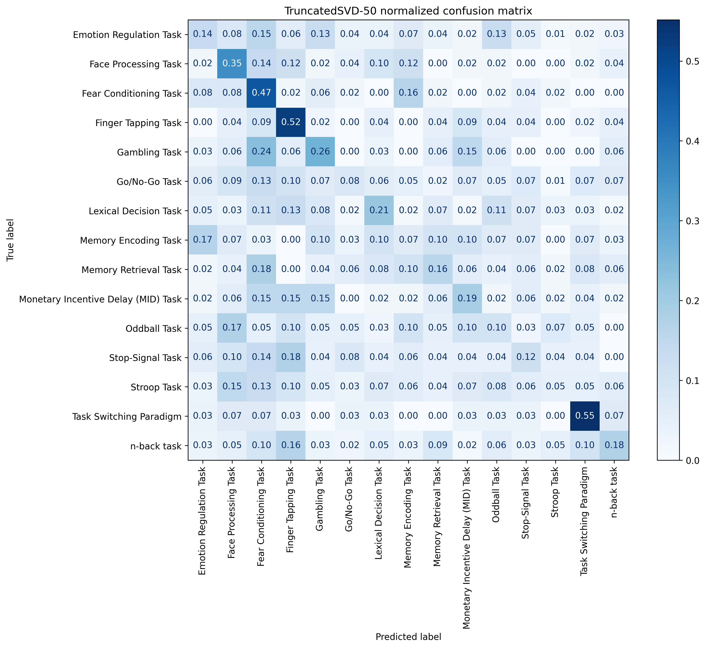
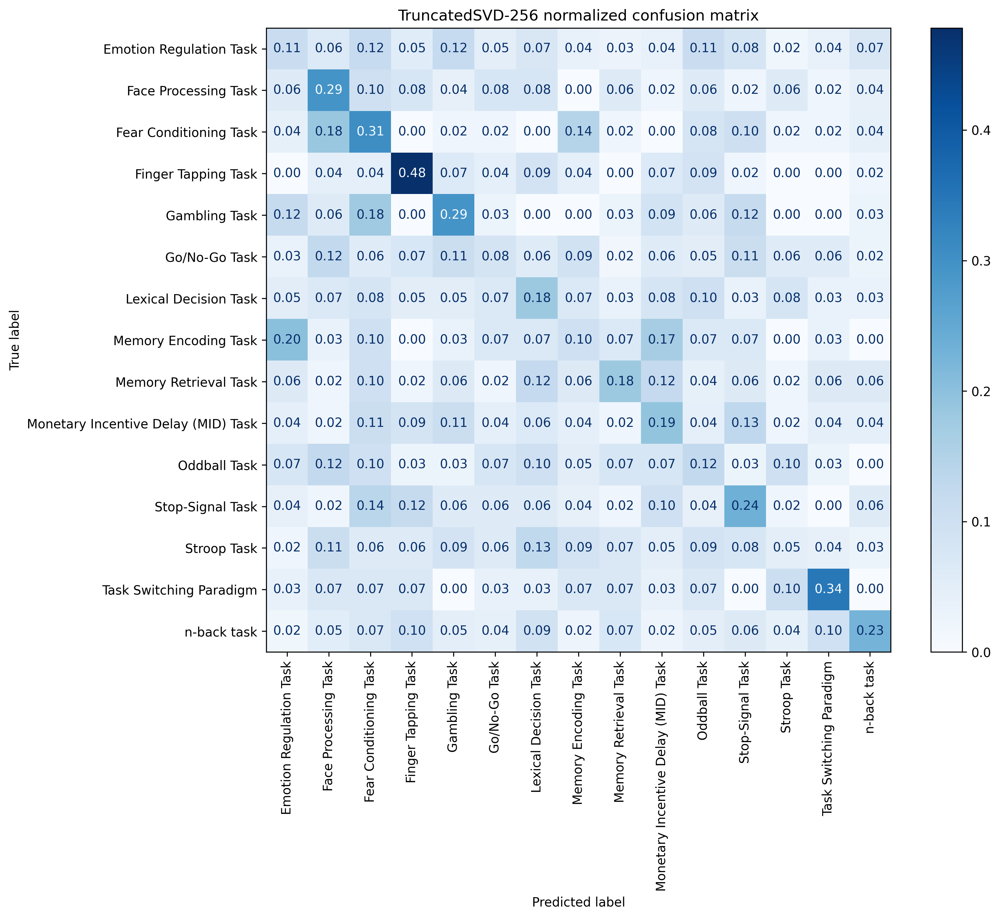
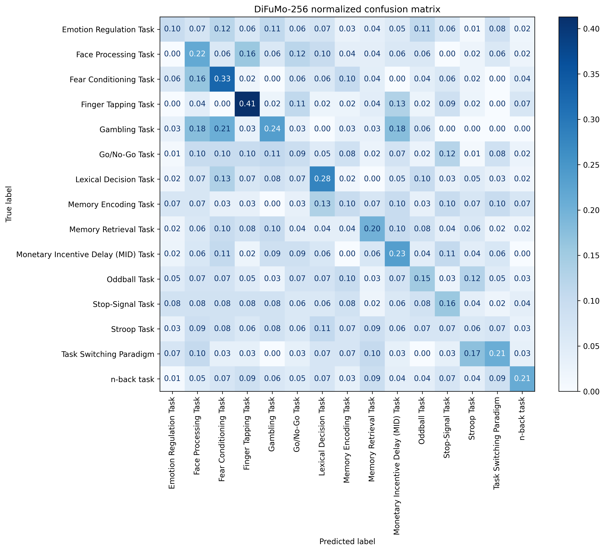

# A Machine-Learning Interface for NiMARE

Google Summer of Code 2026 — INCF / NiMARE

## Project Overview

This project develops a machine-learning interface for NiMARE that converts
coordinate-based Studysets into scikit-learn-compatible feature datasets. The
goal is to connect NiMARE's modeled-activation (MA) maps with standard prediction
pipelines while preserving analysis provenance and study-level grouping.

The work combines interface development, data preparation, and task-classification
experiments on real NeuroStore data.

## Main Contributions

- **Feature extraction:** Implemented `MAFeatureDataset` to organize map features,
  optional numeric metadata and annotation descriptors, targets, identifiers, and
  provenance. `MAFeatureExtractor` generates sparse MA features using NiMARE kernels
  and exports these data as a scikit-learn `Bunch`, including analysis IDs and study
  groups.
- **Pipeline integration:** Provided an unfitted preprocessor through
  `bunch.preprocessor`, allowing dimensionality reduction to be fitted inside a
  scikit-learn Pipeline on training data. Study groups are exposed for grouped
  splitting and cross-validation.
- **Dimensionality reduction:** Added TruncatedSVD and atlas aggregation, including
  support for continuous maps and discrete label atlases. 
- **Tests and examples:** Added tests for dataset consistency, feature extraction,
  missing coordinates, caching, and reducers, together with API documentation and
  machine-learning examples.

Implementation and review discussion:
[NiMARE pull request #1148](https://github.com/neurostuff/NiMARE/pull/1148).

## Task Classification Experiment

To exercise the interface on real data, I prepared a single-label task-classification
subset from a neurostore studyset. Task names were normalized,
equivalent variants were grouped into task families, multi-task studies were
excluded, and only classes supported by at least 100 studies were retained.
Derived datasets were created without overwriting the original Studyset.

The prepared subset contains **15 task classes, 2,967 studies, and 11,005 analyses**
before coordinate filtering. Its `studyset.json` records provenance, filtering
details, and table hashes.

The current holdout script uses:

- MA maps generated with `MKDAKernel(r=10)`, dropping analyses without coordinates.
- Task labels from `metadata.comparison_task`.
- A stratified 90%/10% train/test split by study, with random seed 13. Analyses from
  the same study remain in the same split.
- TruncatedSVD with 256 components or a 256-map DiFuMo atlas at 2 mm resolution.
- StandardScaler followed by logistic regression with balanced class weights and
  `max_iter=1000`.
- Analysis-level precision, recall, support, and overall accuracy.

The scripts, prepared dataset, dependency requirements, and running instructions
are available in the
[task-classification repository](https://github.com/lyraluoyu/nimare-task-classification).

## Results

The following confusion matrices record exploratory runs during development.
Rows are true task labels, columns are predicted labels, and each row is normalized
to sum to one. Diagonal entries represent per-task recall; off-diagonal entries
show misclassification between tasks. 

### TruncatedSVD-50

An earlier baseline using 50 components. Finger tapping and task switching show
relatively stronger recall in this run, while many other task labels remain
confused. 

### TruncatedSVD-256

Increasing the number of components changes the confusion pattern but does not
consistently improve recall across task classes.

### DiFuMo-256

Functional-atlas aggregation provides an alternative to data-driven SVD features.
This run also shows substantial cross-task confusion.

## Summary

This project connects NiMARE Studysets with scikit-learn through sparse MA feature extraction and pipeline-compatible dimensionality reduction. Tests, documentation, and real-data task-classification experiments illustrate the workflow.
